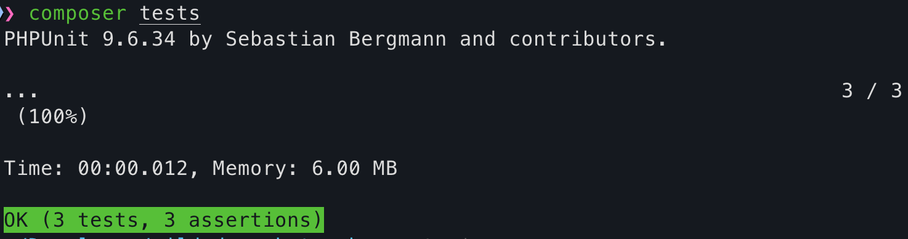

# Gilded Rose Kata – Solution

This repository contains my solution to the **Gilded Rose Kata**, a well-known refactoring exercise used to practice working with legacy code, improving design, and adding features safely.

## What is the Gilded Rose Kata?

The Gilded Rose Kata is a refactoring kata originally created by Terry Hughes.  
You are given a piece of legacy code that manages the quality and sell-by dates of items in a shop.

The rules are intentionally a bit quirky, and the code is usually written in a way that makes change difficult.  
The goal is to **add new functionality without breaking existing behavior**, while gradually improving the structure and readability of the code.

This kata focuses on:

- Refactoring legacy code safely
- Working with existing tests (or adding tests first)
- Incremental design improvements
- Clean, readable, and maintainable code

## Requirements

The original kata requirements and rules can be found here:

- Official Gilded Rose Kata repository:  
  https://github.com/emilybache/GildedRose-Refactoring-Kata

- Official Gilded Rose Kata requirements specification can be found here:  
  https://github.com/emilybache/GildedRose-Refactoring-Kata/blob/main/GildedRoseRequirements.md

- Original kata base code(PHP):
  https://github.com/emilybache/GildedRose-Refactoring-Kata/tree/main/php

## My Approach

- Started by understanding the existing behavior through official requirements and tests
- Ensured all original rules were covered by tests
- Refactored step by step, keeping behavior unchanged
- Focused on readability, small methods, and clear responsibilities
- Avoided large rewrites in favor of incremental improvements
- Solved by Strategy Design Pattern

## Code

- My solution (this repository):  
  **[Link to your GitHub repository]**

## Test Results

All tests are passing after refactoring and implementing the required behavior.

> _Screenshot shows successful execution of the full test suite._

## Notes

This kata was a great exercise in resisting the urge to rewrite everything and instead improving the code safely over time.  
It highlights how tests enable confident refactoring and how small, consistent improvements add up.
